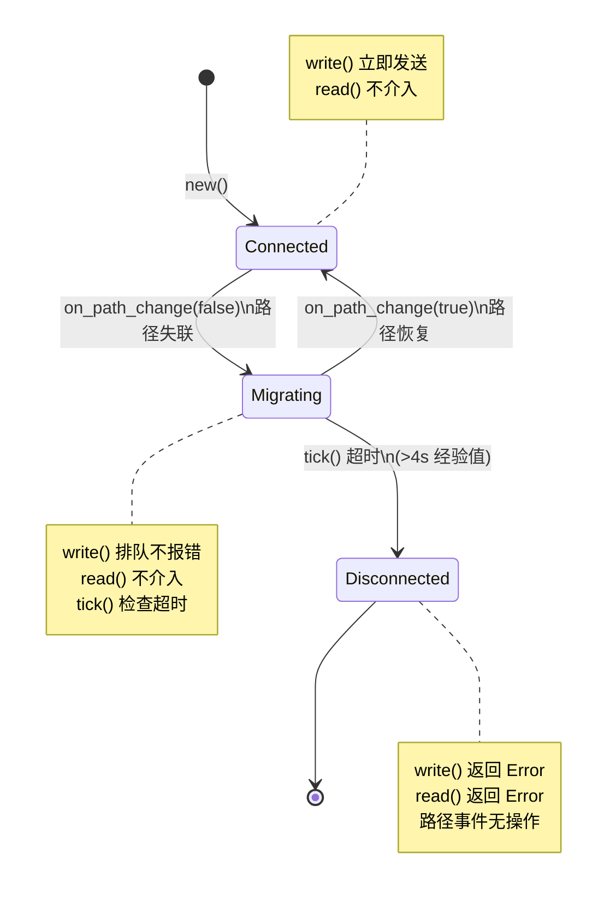

# LinkState 三态状态机设计说明

> 对应需求文档 §1.4「迁移中状态（Migrating）语义设计」

---

## 1. 设计背景

QUIC 的路径迁移是"连接语义不变、仅物理路径变化"，而 Zenoh 原生 Link 模型只有"活着"/"断了"二态。若不做处理，会导致要么误判断连触发不必要重连，要么迁移失败时迟迟不重连造成业务静默丢包。

## 2. 状态转换图



## 3. 各状态行为说明

### 3.1 Connected（连接正常）

| 操作 | 行为 |
|------|------|
| `write(data)` | 立即发送，返回 `WriteStatus::Sent` |
| `read()` | 返回 `Ok(())`（不介入，信任 QUIC RecvStream） |
| `on_path_change(false)` | 转入 `Migrating` 态，记录时间戳 |
| `tick()` | 无操作 |

### 3.2 Migrating（路径迁移中）

| 操作 | 行为 |
|------|------|
| `write(data)` | 数据进入 `VecDeque` 排队，返回 `WriteStatus::Queued`（**不报错**） |
| `read()` | 不介入，返回 `Ok(())`（信任 QUIC RecvStream 的容忍度） |
| `on_path_change(true)` | 转入 `Connected` 态，排队数据可通过 `drain_queue()` 批量发送 |
| `tick()` | 检查超时：超时 → `Disconnected` + 作废队列；未超时 → `None` |

### 3.3 Disconnected（连接已断开）

| 操作 | 行为 |
|------|------|
| `write(data)` | 返回 `Err(LinkError::Disconnected)` |
| `read()` | 返回 `Err(LinkError::Disconnected)` |
| `on_path_change(_)` | 无操作（不自动恢复） |
| `tick()` | 无操作（返回 `None`） |

## 4. 超时阈值说明

| 参数 | 当前值 | 来源 | 备注 |
|------|--------|------|------|
| `MIGRATING_TIMEOUT_MS` | **4000ms** | 需求文档建议 3-5s 经验值（中位） | **TODO: 待用例4/5实测数据标定** |

**标定计划**：
1. 在 Phase 3 用例 4（网络切换模拟）中实测 Iroh 底层从失联到恢复的耗时分布 P50/P95/P99。
2. 用例 5 补充数据完整性校验。
3. 在 P95 基础上增加安全裕度（建议 1.2-1.5x），回填此常量，替换经验值。

**当前风险**：若实际 P95 迁移耗时 > 4s，可能导致过早进入 Disconnected，产生不必要的重连事件。

## 5. 可观测性设计

### 5.1 事件定义

| 事件 | 触发条件 | 用途 | 是否参与重连决策 |
|------|----------|------|:---:|
| `LinkEvent::PathMigrated` | Connected → Migrating | tracing span `link.path_migrated`，记录迁移开始 | **否** |
| `LinkEvent::PathRestored` | Migrating → Connected | tracing span `link.path_restored`，记录恢复 | **否** |
| `LinkEvent::MigrationTimeout` | Migrating → Disconnected | tracing warn，记录超时及作废队列长度 | **是**（上层据此触发重连） |

### 5.2 设计原则

- `PathMigrated` 和 `PathRestored` 仅用于 **tracing/metrics**，不参与 Zenoh 侧重连决策。
- 只有 `MigrationTimeout` 事件才是上层触发重连的可靠信号。
- 代码走查确认：`on_path_change()` 返回的 `PathMigrated`/`PathRestored` 不修改任何 Zenoh 连接状态的判断逻辑。

### 5.3 tracing 埋点

```rust
// 迁移开始
tracing::info_span!("link.path_migrated").in_scope(|| {
    tracing::info!("Path migration started, entering Migrating state");
});

// 迁移恢复
tracing::info_span!("link.path_restored").in_scope(|| {
    tracing::info!(queue_len, "Path restored, returning to Connected state");
});

// 迁移超时
tracing::warn!(elapsed_ms, discarded_queue_len,
    "Migration timeout, entering Disconnected state; queued data discarded");
```

## 6. 接口改动范围（约束检查）

| 约束 | 状态 |
|------|:---:|
| 不修改对外暴露给 `zenoh-transport` 的公开 trait 签名 | ✅ 满足 |
| `LinkState` 枚举标记为非公开（`enum` 而非 `pub enum`），仅 `LinkStateMachine` 为公开 | ✅ 满足 |
| `Migrating` 态期间不上抛 Error | ✅ 满足 |
| 超时后排队数据明确作废（`self.queue.clear()`） | ✅ 满足 |
| 可观测事件不参与重连决策 | ✅ 满足 |

## 7. 使用示例

```rust
use zenoh_link_state::link_state::{LinkStateMachine, WriteStatus};

// 1. 创建状态机（初始 Connected）
let mut sm = LinkStateMachine::new();

// 2. Connected 态正常写入
assert_eq!(sm.write(b"hello".to_vec()), Ok(WriteStatus::Sent));

// 3. 路径失联 → 进入 Migrating
sm.on_path_change(false);
assert!(sm.is_migrating());

// 4. Migrating 期间写入排队，不报错
assert_eq!(sm.write(b"world".to_vec()), Ok(WriteStatus::Queued));

// 5. 路径恢复 → 回到 Connected
sm.on_path_change(true);
assert!(sm.is_connected());

// 6. 排出排队数据，批量发送
let queued: Vec<_> = sm.drain_queue().into_iter().collect();
assert_eq!(queued, vec![b"world".to_vec()]);
```

## 8. 待办与后续工作

- [ ] **用例 4/5 实测标定**：在 Phase 3 第一批测试完成后，用实测 P95 迁移耗时回填 `MIGRATING_TIMEOUT_MS`。
- [ ] **集成到 `zenoh-link-iroh`**：将本模块从独立 crate 合并到 `zenoh-link-iroh` 的 `LinkUnicast` 实现中。
- [ ] **tokio 异步集成**：在 `LinkUnicast` 的 tokio 上下文中管理 `LinkStateMachine` 的互斥访问（`tokio::sync::Mutex`）。
- [ ] **Metrics 导出**：将 `LinkEvent` 映射为 Prometheus-compatible metrics counter/labels。
